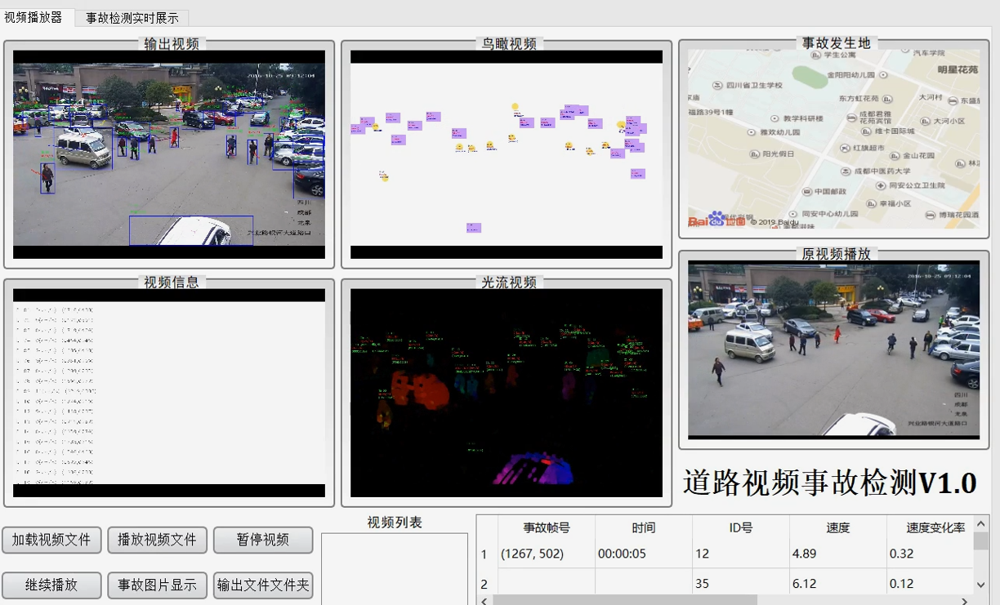

# traffic-accident-detection

##  Introduction

This project aims to infer traffic accident based on computer vision. Our method uses combined models based on `yolov3` and `deepsort`. Expriments show that our method outperforms state-of-the-art. More information please see [CSDN](https://blog.csdn.net/chiyukunpeng/article/details/103236840?spm=1001.2014.3001.5502)


## Quick Start

#### 1 Requirements
Python 3.7 or later with all requirements.txt dependencies installed. To install run:
```
$ pip install -r requirements.txt
```
#### 2 Download our pretrained weights
You can download the `yolov3` weights by clicking [code:9llk](https://pan.baidu.com/s/1j4SuW7pvJGGt00YzEuhqzg) and `deepsort` weights [code:b1ig](https://pan.baidu.com/s/1OcE3hLukoBZrDbsRIdFgpQ) then save them to the `data` folder.

#### 3 Run main.py
```
python main.py
```
The output flag saves your object tracker results as an avi file for you to watch back. It is not necessary to have the flag if you don't want to save the resulting video.

## References
https://github.com/zzh8829/yolov3-tf2
https://github.com/nwojke/deep_sort

## Citation
If you find this project useful for your research, please cite:
```
@{traffic accident detection project,
author = {chen peng},
title = {TAD},
website = {https://github.com/chiyukunpeng/traffic-accident-detection},
month = {March},
year = {2021}
}
```
